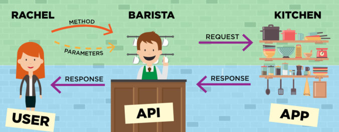

# API REST

Uma **API** (Application Programming Interface) ou _**Interface de Programação de Aplicações**_ é um conjunto de rotinas e padrões por trás de uma sistema para que ela possa fornecer serviços para outros sistemas sem que essas outras aplicações precisem conhecer detalhes de implementação ou de manipulação dessas informações.

*fonte:<https://programathor.com.br/blog/o-que-e-api/>*

Basicamente, ao consumir dados através de uma API, uma aplicação precisa fornecer unicamente detalhes sobre as informações que deseja imputar ou consultar em uma determinada URL (rota) e toda a mágica será feita pela aplicação de forma transparente.

**REST** (Representational State Transfer) ou _**Transferência de Estado Representacional**_ é a capacidade que uma aplicação tem de se comunicar com outras utilizando representações como XML, JSON ou outros. Essas transferências são feitas utilizando métodos **HTTP** como **POST**, **GET**, **PUT** e **DELETE** que servem de meio de comunicação (interfaces) para transferência dessas representações de dados entre API e aplicações consumidoras.

Request

Response

Quando um sistema tem a capacidade de aplicar princípios REST é chamado **RESTFull**.

[Voltar](./README.md) <---- | ----> [Avançar](./02NodeJS.md)

